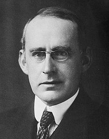

<table class="infobox biography vcard">
<tbody>
<tr>
<th colspan="2">

<a title="Sir" href="https://en.wikipedia.org/wiki/Sir">Sir</a>

 

Arthur Eddington

 

<a class="mw-redirect" title="Member of the Order of Merit" href="https://en.wikipedia.org/wiki/Member_of_the_Order_of_Merit">OM</a>&nbsp;<a title="Fellow of the Royal Society" href="https://en.wikipedia.org/wiki/Fellow_of_the_Royal_Society">FRS</a>

</th>
</tr>
<tr>
<td colspan="2">

Arthur Stanley Eddington (1882&ndash;1944)

</td>
</tr>
<tr>
<th scope="row">Born</th>
<td>

Arthur Stanley Eddington

 28 December 1882 

<a title="Kendal" href="https://en.wikipedia.org/wiki/Kendal">Kendal</a>,&nbsp;<a title="Westmorland" href="https://en.wikipedia.org/wiki/Westmorland">Westmorland</a>, England, United Kingdom

</td>
</tr>
<tr>
<th scope="row">Died</th>
<td>22 November 1944&nbsp;(aged&nbsp;61) 

<a title="Cambridge" href="https://en.wikipedia.org/wiki/Cambridge">Cambridge</a>,&nbsp;<a title="Cambridgeshire" href="https://en.wikipedia.org/wiki/Cambridgeshire">Cambridgeshire</a>, England, United Kingdom

</td>
</tr>
<tr>
<th scope="row">Nationality</th>
<td class="category"><a title="English people" href="https://en.wikipedia.org/wiki/English_people">English</a></td>
</tr>
<tr>
<th scope="row">Citizenship</th>
<td class="category"><a title="United Kingdom of Great Britain and Ireland" href="https://en.wikipedia.org/wiki/United_Kingdom_of_Great_Britain_and_Ireland">British</a></td>
</tr>
<tr>
<th scope="row">Alma&nbsp;mater</th>
<td><a title="Victoria University of Manchester" href="https://en.wikipedia.org/wiki/Victoria_University_of_Manchester">University of Manchester</a> <a title="Trinity College, Cambridge" href="https://en.wikipedia.org/wiki/Trinity_College,_Cambridge">Trinity College, Cambridge</a></td>
</tr>
<tr>
<th scope="row">Known&nbsp;for</th>
<td><a title="Radiative transfer" href="https://en.wikipedia.org/wiki/Radiative_transfer#The_Eddington_approximation">Eddington approximation</a> <a title="Eddington experiment" href="https://en.wikipedia.org/wiki/Eddington_experiment">Eddington experiment</a> <a class="mw-redirect" title="Eddington limit" href="https://en.wikipedia.org/wiki/Eddington_limit">Eddington limit</a> <a title="Eddington number" href="https://en.wikipedia.org/wiki/Eddington_number">Eddington number</a> <a class="mw-redirect" title="Eddington valve" href="https://en.wikipedia.org/wiki/Eddington_valve">Eddington valve</a> <a class="mw-redirect" title="Eddington&ndash;Dirac number" href="https://en.wikipedia.org/wiki/Eddington%E2%80%93Dirac_number">Eddington&ndash;Dirac number</a> <a title="Eddington&ndash;Finkelstein coordinates" href="https://en.wikipedia.org/wiki/Eddington%E2%80%93Finkelstein_coordinates">Eddington&ndash;Finkelstein coordinates</a> Eddington&ndash;Sweet circulation</td>
</tr>
<tr>
<th scope="row">Awards</th>
<td><a title="Royal Society" href="https://en.wikipedia.org/wiki/Royal_Society">Royal Society</a>&nbsp;<a title="Royal Medal" href="https://en.wikipedia.org/wiki/Royal_Medal">Royal Medal</a>&nbsp;(1928) <a title="Smith's Prize" href="https://en.wikipedia.org/wiki/Smith%27s_Prize">Smith's Prize</a>&nbsp;(1907) <a title="Royal Astronomical Society" href="https://en.wikipedia.org/wiki/Royal_Astronomical_Society">RAS</a>&nbsp;<a title="Gold Medal of the Royal Astronomical Society" href="https://en.wikipedia.org/wiki/Gold_Medal_of_the_Royal_Astronomical_Society">Gold Medal</a>&nbsp;(1924) <a title="Henry Draper Medal" href="https://en.wikipedia.org/wiki/Henry_Draper_Medal">Henry Draper Medal</a>&nbsp;(1924) <a title="Bruce Medal" href="https://en.wikipedia.org/wiki/Bruce_Medal">Bruce Medal</a>&nbsp;(1924) <a class="mw-redirect" title="Knights Bachelor" href="https://en.wikipedia.org/wiki/Knights_Bachelor">Knights Bachelor</a>&nbsp;(1930) <a title="Order of Merit" href="https://en.wikipedia.org/wiki/Order_of_Merit">Order of Merit</a>&nbsp;(1938)</td>
</tr>
<tr>
<td colspan="2"><strong>Scientific career</strong></td>
</tr>
<tr>
<th scope="row">Fields</th>
<td class="category"><a title="Astrophysics" href="https://en.wikipedia.org/wiki/Astrophysics">Astrophysics</a></td>
</tr>
<tr>
<th scope="row">Institutions</th>
<td><a title="Trinity College, Cambridge" href="https://en.wikipedia.org/wiki/Trinity_College,_Cambridge">Trinity College, Cambridge</a></td>
</tr>
<tr>
<th scope="row">Academic advisors</th>
<td>

<ul>
<li><a title="E. T. Whittaker" href="https://en.wikipedia.org/wiki/E._T._Whittaker">E. T. Whittaker</a></li>
<li><a title="Alfred North Whitehead" href="https://en.wikipedia.org/wiki/Alfred_North_Whitehead">Alfred North Whitehead</a></li>
<li><a class="mw-redirect" title="Ernest William Barnes" href="https://en.wikipedia.org/wiki/Ernest_William_Barnes">Ernest William Barnes</a></li>
<li><a title="Robert Alfred Herman" href="https://en.wikipedia.org/wiki/Robert_Alfred_Herman">Robert Alfred Herman</a></li>
</ul>

</td>
</tr>
<tr>
<th scope="row">Doctoral students</th>
<td><a title="Subrahmanyan Chandrasekhar" href="https://en.wikipedia.org/wiki/Subrahmanyan_Chandrasekhar">Subrahmanyan Chandrasekhar</a> <a title="Leslie Comrie" href="https://en.wikipedia.org/wiki/Leslie_Comrie">Leslie Comrie</a> <a title="Cecilia Payne-Gaposchkin" href="https://en.wikipedia.org/wiki/Cecilia_Payne-Gaposchkin">Cecilia Payne-Gaposchkin</a> <a title="Hermann Bondi" href="https://en.wikipedia.org/wiki/Hermann_Bondi">Hermann Bondi</a></td>
</tr>
<tr>
<th scope="row">Other&nbsp;notable students</th>
<td><a title="Georges Lema&icirc;tre" href="https://en.wikipedia.org/wiki/Georges_Lema%C3%AEtre">Georges Lema&icirc;tre</a></td>
</tr>
<tr>
<th scope="row">Influences</th>
<td><a title="Horace Lamb" href="https://en.wikipedia.org/wiki/Horace_Lamb">Horace Lamb</a> <a title="Arthur Schuster" href="https://en.wikipedia.org/wiki/Arthur_Schuster">Arthur Schuster</a> <a title="Swarthmore Lecture" href="https://en.wikipedia.org/wiki/Swarthmore_Lecture">John William Graham</a></td>
</tr>
</tbody>
</table>
 

<strong>Sir Arthur Stanley Eddington</strong>&nbsp;<a class="mw-redirect" title="Member of the Order of Merit" href="https://en.wikipedia.org/wiki/Member_of_the_Order_of_Merit">OM</a>&nbsp;<a title="" href="https://en.wikipedia.org/wiki/Fellow_of_the_Royal_Society">FRS</a>&nbsp;(28 December 1882 &ndash; 22 November 1944) was an English astronomer, physicist, and mathematician. He was also a&nbsp;<a title="Philosophy of science" href="https://en.wikipedia.org/wiki/Philosophy_of_science">philosopher of science</a>&nbsp;and a populariser of science. The&nbsp;<a class="mw-redirect" title="Eddington limit" href="https://en.wikipedia.org/wiki/Eddington_limit">Eddington limit</a>, the natural limit to the&nbsp;<a title="Luminosity" href="https://en.wikipedia.org/wiki/Luminosity">luminosity</a>&nbsp;of stars, or the radiation generated by accretion onto a compact object, is named in his honour.

Around 1920, he anticipated the discovery and mechanism of nuclear fusion processes in stars, in his paper "The Internal Constitution of the Stars".&nbsp;At that time, the source of stellar energy was a complete mystery; Eddington was the first to correctly speculate that the source was fusion of hydrogen into helium.

Eddington wrote a number of articles that announced and explained&nbsp;<a title="Albert Einstein" href="https://en.wikipedia.org/wiki/Albert_Einstein">Einstein's</a>&nbsp;theory of&nbsp;<a title="General relativity" href="https://en.wikipedia.org/wiki/General_relativity">general relativity</a>&nbsp;to the English-speaking world.&nbsp;<a title="World War I" href="https://en.wikipedia.org/wiki/World_War_I">World War I</a>&nbsp;had severed many lines of scientific communication, and new developments in German science were not well known in England. He also conducted&nbsp;<a title="Eddington experiment" href="https://en.wikipedia.org/wiki/Eddington_experiment">an expedition</a>&nbsp;to observe the&nbsp;<a title="Solar eclipse of May 29, 1919" href="https://en.wikipedia.org/wiki/Solar_eclipse_of_May_29,_1919">solar eclipse of 29 May 1919</a>&nbsp;that provided one of the earliest confirmations of general relativity, and he became known for his popular expositions and interpretations of the theory.

 

<strong> Publications: </strong>

<ul>

 <li><a target="_blank" href="https://github.com/manjunath5496/Arthur-Stanley-Eddington-Papers/blob/master/tst(280).pdf" style="text-decoration:none;">The Nature of the Physical World</a></li>
 <li><a target="_blank" href="https://github.com/manjunath5496/Arthur-Stanley-Eddington-Papers/blob/master/tst(281).pdf" style="text-decoration:none;">The internal constitution of the stars</a></li>
  <li><a target="_blank" href="https://github.com/manjunath5496/Arthur-Stanley-Eddington-Papers/blob/master/tst(282).pdf" style="text-decoration:none;">The mathematical theory of relativity</a></li>
 <li><a target="_blank" href="https://github.com/manjunath5496/Arthur-Stanley-Eddington-Papers/blob/master/tst(283).pdf" style="text-decoration:none;">New Pathways In Science </a></li>
   <li><a target="_blank" href="https://github.com/manjunath5496/Arthur-Stanley-Eddington-Papers/blob/master/tst(284).pdf" style="text-decoration:none;">Relativity Theory of Protons and Electrons</a></li>
 <li><a target="_blank" href="https://github.com/manjunath5496/Arthur-Stanley-Eddington-Papers/blob/master/tst(285).pdf" style="text-decoration:none;">Science and the unseen world</a></li>
 
<li><a target="_blank" href="https://github.com/manjunath5496/Arthur-Stanley-Eddington-Papers/blob/master/tst(286).pdf" style="text-decoration:none;">Space, Time and Gravitation</a></li>
 <li><a target="_blank" href="https://github.com/manjunath5496/Arthur-Stanley-Eddington-Papers/blob/master/tst(287).pdf" style="text-decoration:none;">The Expanding Universe</a></li>
 
 
 <li><a target="_blank" href="https://github.com/manjunath5496/Arthur-Stanley-Eddington-Papers/blob/main/a(1).pdf" style="text-decoration:none;">The Radiation of the Stars</a></li>

 <li><a target="_blank" href="https://github.com/manjunath5496/Arthur-Stanley-Eddington-Papers/blob/main/a(2).pdf" style="text-decoration:none;">The Deflection of Light during a Solar Eclipse</a></li>

<li><a target="_blank" href="https://github.com/manjunath5496/Arthur-Stanley-Eddington-Papers/blob/main/a(3).pdf" style="text-decoration:none;">Gravitational Deflection of High-speed Particles</a></li>
 <li><a target="_blank" href="https://github.com/manjunath5496/Arthur-Stanley-Eddington-Papers/blob/main/a(4).pdf" style="text-decoration:none;">The Double-Drift Theory of Star Motions</a></li>                              
<li><a target="_blank" href="https://github.com/manjunath5496/Arthur-Stanley-Eddington-Papers/blob/main/a(5).pdf" style="text-decoration:none;">Halley's Observations on Halley's Comet</a></li>
<li><a target="_blank" href="https://github.com/manjunath5496/Arthur-Stanley-Eddington-Papers/blob/main/a(6).pdf" style="text-decoration:none;">The Predicted Shift of the Fraunhofer Lines</a></li>
 <li><a target="_blank" href="https://github.com/manjunath5496/Arthur-Stanley-Eddington-Papers/blob/main/a(7).pdf" style="text-decoration:none;">A Relativity Paradox</a></li>

 <li><a target="_blank" href="https://github.com/manjunath5496/Arthur-Stanley-Eddington-Papers/blob/main/a(8).pdf" style="text-decoration:none;"> The Borderland of Astronomy and Geology </a></li>
   <li><a target="_blank" href="https://github.com/manjunath5496/Arthur-Stanley-Eddington-Papers/blob/main/a(9).pdf" style="text-decoration:none;">The Relation between the Masses and Luminosities of the Stars</a></li>
  
   
 <li><a target="_blank" href="https://github.com/manjunath5496/Arthur-Stanley-Eddington-Papers/blob/main/a(10).pdf" style="text-decoration:none;">A Comparison of Whitehead's and Einstein's Formulae</a></li>                              
<li><a target="_blank" href="https://github.com/manjunath5496/Arthur-Stanley-Eddington-Papers/blob/main/a(11).pdf" style="text-decoration:none;">The Mass of the Universe</a></li>
<li><a target="_blank" href="https://github.com/manjunath5496/Arthur-Stanley-Eddington-Papers/blob/main/a(12).pdf" style="text-decoration:none;">
The Factor 137/136 in Quantum Theory</a></li>
<li><a target="_blank" href="https://github.com/manjunath5496/Arthur-Stanley-Eddington-Papers/blob/main/a(13).pdf" style="text-decoration:none;">Theory of the Stem-Gerlach Effect</a></li>

<li><a target="_blank" href="https://github.com/manjunath5496/Arthur-Stanley-Eddington-Papers/blob/main/a(14).pdf" style="text-decoration:none;">The Problem of Stellar Luminosity</a></li>
                              
<li><a target="_blank" href="https://github.com/manjunath5496/Arthur-Stanley-Eddington-Papers/blob/main/a(15).pdf" style="text-decoration:none;">Atomic Transmutation and the Temperatures of Stars</a></li>

<li><a target="_blank" href="https://github.com/manjunath5496/Arthur-Stanley-Eddington-Papers/blob/main/a(16).pdf" style="text-decoration:none;">Liquid Stars</a></li>

  <li><a target="_blank" href="https://github.com/manjunath5496/Arthur-Stanley-Eddington-Papers/blob/main/a(17).pdf" style="text-decoration:none;">Liquid Stars and Atomic Volume</a></li>   
  
<li><a target="_blank" href="https://github.com/manjunath5496/Arthur-Stanley-Eddington-Papers/blob/main/a(18).pdf" style="text-decoration:none;">Ether-drift and the Relativity Theory</a></li> 

 
 
 
 
 
</ul>
